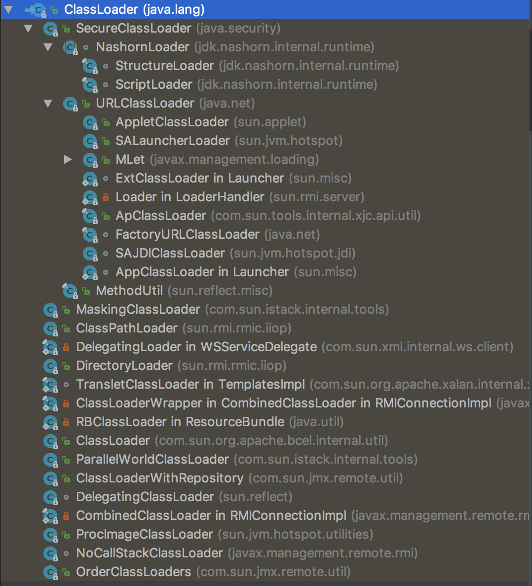
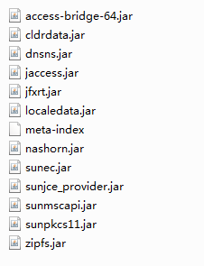

<a href="#a1">ClassLoader抽象类</a>

<a href="#a2">常用加载器</a>

<a href="#a3">委托模型</a>


#### <a id="a1"> </a>abstract Class ClassLoader

##### 注释

**写在前面**：下文频繁使用了“实例（instance）”、“对象（object）”等表述，并非指我们通常所说的通过new关键字创建出来的对象。通过`Class.newInstance`创建的对象，则是我们通常所说的对象。

`ClassLoader`负责加载类。给出一个类的二进制名称，类加载器试图定位或生成构成该类的定义的数据。典型的策略是将名称转换成文件名并从文件系统读取这个class文件。

每一个类对象都包含对定义了当前对象的`ClassLoader`的引用——`getClassLoader()`。*补充*：如果`getClassLoader()`返回null，则该类是由默认的根加载器加载的，这是由于根加载器使用C实现，没有对应的Java类能指向它。

数组类的类对象不是被类加载器创建的，而是在Java运行时根据需要创建的。数组类的类加载器（`getClassLoader()`的返回值）和它的元素类型的类加载器是一致的。

应用程序实现了`ClassLoader`的子类以达到动态加载类的目的。

安全管理器通过类加载器表示安全域（security domains）。

`ClassLoader`类使用委托（delegation）模型（中文翻译成“双亲委派”，太魔性）搜索类和资源。每一个`ClassLoader`实例关联一个父级类加载器。当收到一个类或资源的查找请求时，`ClassLoader`实例在自己动手查找之前会先将查找任务交给父级加载器。虚拟机内置的类加载器，称为“bootstrap class loader”，没有父级但可以作为其他`ClassLoader`实例的父级。

支持并发加载类文件的类加载器被称为“parallel capable”类加载器，并且要求在类初始化的时候通过调用`ClassLoader.registerAsParallelCapable`进行注册。然而，它的子类如果要获得并行能力需要也注册。

在使用非严格层级结构的委托模型的环境中，类加载器需要并行能力，否则类的加载可能引发死锁，因为在类的加载过程中持有加载器锁（详见`loadClass`函数）。

通常，JVM从基于平台行为的本地文件系统中加载类文件。比如，在UNIX系统中，JVM从环境变量`CLASSPATH`定义的目录加载类文件。

然而，一些类可能不来自文件，他们可能来自其他源，比如网络，或者被应用程序构建。函数`defineClass(String, byte[], int, int)`将字节数组转换成类实例。新定义的类的实例可以使用`Class.newInstance`创建。

类加载器加载的类可能引用了其他类。为了确定被引用类，JVM调用创建该类的类加载器的`loadClass`函数。

比如，一个应用可以创建一个网络类加载器从服务器下载类文件。示例代码可能是这样的：

```java
ClassLoader loader = new NetworkClassLoader(host, port);
Object main = loader.loadClass("Main", true).newInstance();
//...
```

子类网络类加载器必须定义`findClass`和`loadClassData`以从网络加载类。一旦他下载了构成类的字节数组，它使用`defineClass`函数创建类的示例。一个实现示例为：

```java
class NetworkClassLoader extends ClassLoader {
    //...
    public Class findClass(String name) {
        byte[] b = loadClassData(name);
        return defineClass(name, b, 0, b.length);
    }
    //...
}
```

注释写的很完整。实现简单看一下。

##### registerNatives()

这是一个native方法，通过JNI调用JVM的C/C++实现。关于[JNI（jni.h）的介绍](http://www.programmersought.com/article/65431232056/)，记得看一下。

#### <a id="a2"> </a>常用加载器

用idea 看一下`ClassLoader`的继承关系：



*补充一点*：每个版本不太一样，上图展示的是OpenJDK 8的。

**补充二点**：Windows下，JDK安装目录下的**`src.zip`**是JDK源码，如果使用idea查看某个类（比如`ClassLoader`），源码文件（`ClassLoader.java`）就是从里面获取的。但是，当我打开`URLClassLoader`时，只能看到由`.class`文件反编译的结果，因为在`src.zip`中，**没有sun包下的源码**。为了解决这个问题（看反编译的结果很难受的，局部变量名都是var，注释也没有），需要到OpenJDK社区下载包含sun源码的JDK安装包。访问[下载地址](https://adoptopenjdk.net/releases.html)，选择JDK版本（8）、JVM（HotSpot）、和工作平台（Win x64），下载JDK的ZIP安装包并重新安装。Mac下使用homebrew安装的OpenJDK包含sun包源码，无需考虑这样的问题。

##### `BootstrapClassLoader`

根加载器是C实现的，在上图不体现，在Java代码中也没有办法引用。所以：

* 当一个类的`getClassLoader()`返回null，就表示该类是被根加载器加载的；
* 当一个类加载器的`parent`属性指向null，那么就是指向了根加载器（比如`ExtClassLoader`）。

##### `URLClassLoader`

该加载器必须使用`URL[] urls`进行构造，该参数是类加载器寻找类和资源的目录或者JAR包。其中`AccessController`负责处理文件访问的权限问题。下面的两个加载器都是该类的扩展。

##### `ExtClassLoader`

* `ExtClassLoader`的`parent`属性指向null，即根加载器。

* `The class loader used for loading installed extensions.`什么是“installed extensions”？根据[Installed Extensions](https://docs.oracle.com/javase/tutorial/ext/basics/install.html)网站的定义：已安装扩展是指JRE软件的`lib/ext`目录下的JAR文件。如下图：

  

  具体来看一下获取`urls`参数的函数：

  ```java
  private static File[] getExtDirs() {
      String s = System.getProperty("java.ext.dirs");
      File[] dirs;
      if (s != null) {
          StringTokenizer st =
              new StringTokenizer(s, File.pathSeparator);
          int count = st.countTokens();
          dirs = new File[count];
          for (int i = 0; i < count; i++) {
              dirs[i] = new File(st.nextToken());
          }
      } else {
          dirs = new File[0];
      }
      return dirs;
  }
  ```

  其中，`System.getProperty("java.ext.dirs")`即为扩展目录，自己的本子上打印一下：

  ```java
  System.out.println(System.getProperty("java.ext.dirs"));
  ```

  输出如下：

  ```
  D:\coding-basic\openjdk8\jdk8u222-b10\jre\lib\ext;C:\Windows\Sun\Java\lib\ext
  ```

  其中，第一个目录就是了，第二个目录不存在。将第一个目录下的文件截图如下：

  

  **补充**：有人说`ExtClassLoader`负责加载`javax`包下的类，不对，`javax`包位于`rt.jar`，在`lib/`目录下，即这些扩展包的上层。

##### `AppClassLoader`

* `AppClassLoader`的`parent`属性指向`ExtClassLoader`对象；

* 同理，该加载器负责的目录为

  ```java
  final String s = System.getProperty("java.class.path");
  ```

  在本机打印一下：

  ```java
  file:/D:/coding-basic/openjdk8/jdk8u222-b10/jre/lib/charsets.jar
  file:/D:/coding-basic/openjdk8/jdk8u222-b10/jre/lib/ext/access-bridge-64.jar
  file:/D:/coding-basic/openjdk8/jdk8u222-b10/jre/lib/ext/cldrdata.jar
  file:/D:/coding-basic/openjdk8/jdk8u222-b10/jre/lib/ext/dnsns.jar
  file:/D:/coding-basic/openjdk8/jdk8u222-b10/jre/lib/ext/jaccess.jar
  file:/D:/coding-basic/openjdk8/jdk8u222-b10/jre/lib/ext/localedata.jar
  file:/D:/coding-basic/openjdk8/jdk8u222-b10/jre/lib/ext/nashorn.jar
  file:/D:/coding-basic/openjdk8/jdk8u222-b10/jre/lib/ext/sunec.jar
  file:/D:/coding-basic/openjdk8/jdk8u222-b10/jre/lib/ext/sunjce_provider.jar
  file:/D:/coding-basic/openjdk8/jdk8u222-b10/jre/lib/ext/sunmscapi.jar
  file:/D:/coding-basic/openjdk8/jdk8u222-b10/jre/lib/ext/sunpkcs11.jar
  file:/D:/coding-basic/openjdk8/jdk8u222-b10/jre/lib/ext/zipfs.jar
  file:/D:/coding-basic/openjdk8/jdk8u222-b10/jre/lib/jce.jar
  file:/D:/coding-basic/openjdk8/jdk8u222-b10/jre/lib/jsse.jar
  file:/D:/coding-basic/openjdk8/jdk8u222-b10/jre/lib/management-agent.jar
  file:/D:/coding-basic/openjdk8/jdk8u222-b10/jre/lib/resources.jar
  file:/D:/coding-basic/openjdk8/jdk8u222-b10/jre/lib/rt.jar
  file:/D:/coding-basic/idea/untitle/target/classes/
  file:/D:/coding-basic/idea/installpac/IntelliJ%20IDEA%20171.4249.4/lib/idea_rt.jar
  ```

  发现主要分为三类：

  * jre的`lib`目录下和其子目录`ext`下的jar包（不包含其他子目录比如`security`下的jar包）；
  * 当前应用的class文件数据目录（`appname/target/classes/`）；
  * 开发工具（idea）的辅助jar包。

#### <a id="a3"> </a>委托模型

根据上面的分析，已经知道`ExtClassLoader`和`APPClassLoader`分别在哪些地方检索Class文件，但是其中有重叠的部分，比如两个类加载器都可以在jre的`lib/ext/`的jar包文件中检索类。我们先找一下`BootstrapClassLoader`负责加载的目录。`ExtClassLoader`和`APPClassLoader`都是`Launcher`的内部类，该类用于加载“main application”，该类包含如下属性：

```java
private static String bootClassPath = System.getProperty("sun.boot.class.path");
```

该属性最终通过`getBootstrapClassPath()`函数传给了`ClassLoader`类，虽然没找到确凿的证据，我推断这就是`BootstrapClassLoader`负责的地盘。打印一下看看：

```
file:/D:/coding-basic/openjdk8/jdk8u222-b10/jre/lib/resources.jar
file:/D:/coding-basic/openjdk8/jdk8u222-b10/jre/lib/rt.jar
file:/D:/coding-basic/openjdk8/jdk8u222-b10/jre/lib/sunrsasign.jar
file:/D:/coding-basic/openjdk8/jdk8u222-b10/jre/lib/jsse.jar
file:/D:/coding-basic/openjdk8/jdk8u222-b10/jre/lib/jce.jar
file:/D:/coding-basic/openjdk8/jdk8u222-b10/jre/lib/charsets.jar
file:/D:/coding-basic/openjdk8/jdk8u222-b10/jre/lib/jfr.jar
file:/D:/coding-basic/openjdk8/jdk8u222-b10/jre/classes
```

除了最后一个目录不存在，其他均为jre的`lib/`目录下的jar包。

由此可见，三个类加载器的加载目录是有重叠的，大概就是$Path_{Bootstrap}+Path_{Ext}+Path_{target/classes} \approx Path_{App}$。

那么重叠的部分由谁来完成加载呢？这是由委托模型决定的。注释部分有提及，即每个加载类在尝试加载之前，先请求`parent`属性指向的加载器尝试加载，如果父级加载器加载结果为null，再尝试自己加载。

所以责任分配为：

* `BootstrapClassLoader`负责加载`jre/lib/`目录下的jar包和`jre/classes/`目录下的文件（如果有）；
* `ExtClassLoader`负责加载`jre/lib/ext/`目录下的jar包；
* `AppClassLoader`负责加载用户程序的类文件（`target/classes/`）和其他资源（比如IDE的jar包）。


