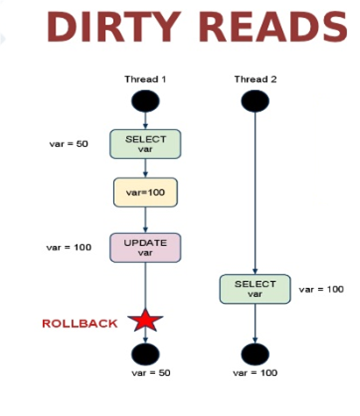
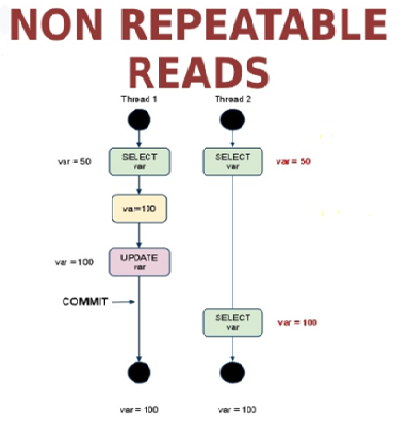
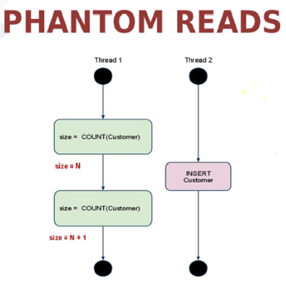

Ubuntu 18.04 LTS + MySQL 8


#### 一点预备知识

* **MySQL的存储引擎**包括InnoDB和MyISAM两种，其中InnoDB支持事物而后者不支持，前者支持行级锁而后者不支持，因此InnoDB比后者更有优势（不仅限于上面两条），MySQL的默认引擎已经从MyISAM变更为InnoDB。

  **MySQL的连接器**包括JDBC和ODBC（“O”代表“Open”），其中前者使用Java而后者基于C/C++，前者跨平台而后者仅支持Windows，前者有更高的性能，因此在Java环境下强烈建议使用JDBC。

* 关于版本选择：

  MySQL Community Edition是社区版本，是免费的，也是我们日常使用的。

#### 使用APT仓库安装MySQL

根据[官方教程](https://dev.mysql.com/doc/mysql-apt-repo-quick-guide/en/)指引：

1、进入[下载页面](https://dev.mysql.com/downloads/mysql/)选择OS为Ubuntu Linux，Version为18.04(x86,64-bit)，点击下方的图片连接跳转到deb下载页面，点击download跳转到新页面，忽略提示信息，直接点击下方的“no thanks, just start my download”。

2、下载的文件为`mysql-apt-config_0.8.13-1_all.deb`，安装软件包

```shell
$sudo dpkg -i mysql-apt-config_0.8.13-1_all.deb
```

跳出弹窗，显示默认安装的mysql版本和组件，如果版本是MySQL 8就不需要修改，点击OK。

3、更新apt仓库并安装MySQL Server

```shell
$sudo apt-get update
$sudo apt-get install mysql-server
```

中途会提示设置root密码，输入两次即可（安装5.7版本不会有这个提示，导致后面登陆出现问题）。如果不是经常用的话，设置`123456`吧。

另外一个弹窗提示选择权限认证插件版本，默认第一项为更新后的版本，选择第二项legacy版本，点击OK。

4、查看服务状态，登录

```shell
$sudo service mysql status
```

```shell
$sudo mysql -u root -p
```

**注**：1、使用`sudo`登录可能需要输入两次密码，第一次是计算机用户密码，第二次才是数据库密码。2、因为安装的时候使用的sudo命令，登录时也要在前面加上sudo命令才可以，否则提示无法访问。

#### 创建用户并允许远程登录

MySQL数据库自带的`mysql`库中的`user`表用于存放用户信息，其中`host`字段表示用户可以进行登录的主机，默认情况下，`root`用户只可以从`localhost`进行登录。

1、使用root用户在本机登录后，创建一个可以任意主机（使用`%`符号）进行登录的用户dinl，密码是`654321`

```mysql
mysql> create user 'dinl'@'%' identified by '654321';
```

2、赋予新用户所有库的查询权限

```mysql
mysql> grant select on *.* to 'dinl'@'%';
mysql> flush privileges;
```

3、此时通过远程可视化工具使用`dinl`连接数据库失败，提示`Public Key Retrieval is not allowed`。

这是因为mysql 8 的升级了用户认证机制导致的。查看当前认证机制：

```mysql
mysql> select host,user,plugin from mysql.user;
```

可以看到`dinl`用户的默认认证机制为`caching_sha2_password`，改为旧版的`mysql_native_password`。

```mysql
mysql> alter user 'dinl'@'%' indentified with mysql_native_password by '654321';
mysql> flush privileges;
```

再次尝试连接，成功。

4、删除用户

```mysql
mysql> drop user 'dinl'@'%';
```


#### 教训

教训一：使用APT安装MySQL时，未严格按照教程的`sudo apt-get update`，而是使用`sudo aptitude update`，总是更新失败，想当然地认为`sudo apt-get update`肯定也更新失败，进行了很多次失败的安装。

教训二：在更改用户的的认证机制时，未严格按照

```mysql
mysql> alter user 'dinl'@'%' indentified with mysql_native_password by '654321';
```

而是想当然的省略了`by '654321'`部分，导致一直连接失败。

上面的两个“想当然”浪费了大量时间。


#### MySQL数据库隔离级别（isolation level）

参考文档：[Back to basics: Isolation Levels In MySQL](https://mydbops.wordpress.com/2018/06/22/back-to-basics-isolation-levels-in-mysql/)

事务（transaction）的四个特性ACID中的I代表隔离性。

隔离定义了Mysql服务器（InnoDB）将每个事务和其他并行执行的食物分离开的方式，并保证多事务以可靠的方式运行。如果事务之间不进行隔离，一个事务可能修改了另一个事务正在读取的数据，因而会发生数据不一致。隔离级别决定了事物之间是如何隔离的。

SQL标准定义的四个隔离级别MySQL全都支持，这四个隔离级别为：

* READ UNCOMMITTED——读未提交
* READ COMMITTED——读已提交
* REPEATABLE READ——可重复读
* SERIALIZABLE——可串行化

根据需求隔离级别可设置为全局或者会话（session）范围。

下面详细介绍每个级别。

##### READ UNCOMMITTED：

在读未提交隔离级别下，事务之前并没有隔离，比如，没有锁。一个事务可以看到另一个事务还未提交的数据修改。这是隔离的最低级别且有很高的性能，因为没有持有锁的开销。在这个隔离水平下，总是会发生脏读（dirty-read）。

这意味着事务甚至可能读到最后根本不存在的数据，因为更新数据的那个事务回退了更新操作且未提交。下面的图帮助我们理解：



##### READ COMMITTED

在读已提交隔离级别下，避免了脏读的现象，以为任何未提交的更新对其他事务是不可见的。这是大部分流行的RDBMS软件默认的隔离级别，但MySQL不是。

在这个隔离级别下，每一个SELECT操作都使用在其执行之前的已提交数据的快照。现在，因为每次SELECT的操作都有自己的快照，相同的SELECT操作在同一个事务中执行多次（期间其他事务可能提交了数据的更新），可能返回不同的结果集。这个现象称为不可重复读（non-repeatable read）。



##### REPEATABLE READ

在可重复读隔离级别下，避免了不可重复读的现象。这是MySQL的默认隔离级别。在这样的隔离级别下，同一个事务执行期间同样的SELECT操作执行多次返回同样的结果。

它是这样工作的，在事务期间SELECT第一次执行的时候获取快照，在该事务期间再次执行相同的SELECT时仍旧使用第一次获取的快照。在这样的隔离级别下的事务不会考虑其他事务对数据的修改，无论更新操作是否提交。这保证了读的一致性。维护快照需要额外的开销并影响性能。

尽管这样的隔离级别解决了不可重复读，但带来了另一个问题：幻读（phantom reads）。

幽灵（phantom）是指一行数据出现在了以前不可见的地方。InnoDB和XtraDB使用多版本并发控制（multi-version concurrency control）解决了幻读问题（所以此时可重复读是可靠的隔离级别）。

可重复读是MySQL默认的事务隔离级别。



##### SERIALIZABLE

可串行化完全隔离的事务对其他事务的影响。这和带有附加限制的可重复读类似，一个事务选择的行不能被其他事务修改直到第一个事务结束。这避免了幻读现象。这个隔离级别是可行的最强的隔离级别。

#### 设置隔离级别

8.0版MySQL事务隔离级别设置参考[SET TRANSACTION Syntax](https://dev.mysql.com/doc/refman/8.0/en/set-transaction.html)

```mysql
SET [GLOBAL | SESSION] TRANSACTION
    transaction_characteristic [, transaction_characteristic] ...

transaction_characteristic: {
    ISOLATION LEVEL level
  | access_mode
}

level: {
     REPEATABLE READ
   | READ COMMITTED
   | READ UNCOMMITTED
   | SERIALIZABLE
}

access_mode: {
     READ WRITE
   | READ ONLY
}
```

查看隔离级别：

```mysql
SELECT @@GLOBAL.transaction_isolation, @@GLOBAL.transaction_read_only;
SELECT @@SESSION.transaction_isolation, @@SESSION.transaction_read_only;
```


