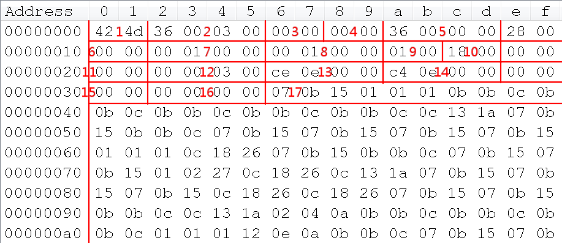
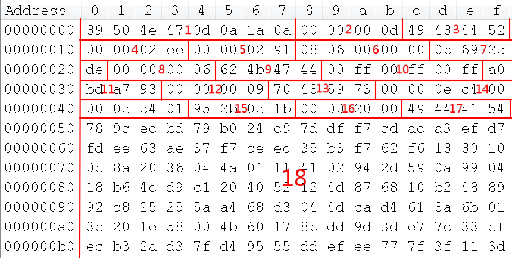

#### BMP存储规则

参考<https://en.wikipedia.org/wiki/BMP_file_format>

##### BMP示例

#### Bitmap File Header

​	**1**> 0~1字节，文件类型，固定值0x4d42（BM）；

​	**2**> 2~5字节，文件大小，示例为0x00030036（文件大小约192KB）；

​	**3**> 6~7字节，保留字段1;

​	**4**> 8~9字节，保留字段2;

​	**5**> 10~13字节，偏移量，可用于快速定位实际数据。示例为0x00000036（从第54字节开始）；

##### Bitmap Information Header

​	**6**> 14~17字节，Bitmap Information Header部分所占大小，示例为0x00000028（40字节）；

​	**7**> 18~21字节，图像宽度，单位像素，示例为0x00000100（256像素）；

​	**8**> 22~25字节，图像高度，单位像素，示例为0x00000100（256像素）；

​	**9**> 26~27字节，颜色平面数，示例为0x0001；

​	**10**> 28~29字节，每像素占用比特数，可取值1、4、8、16、24、32，示例为0x0018（24比特/像素）；

​	**11**> 30~33字节，数据压缩方式，可取值0、1、2、3、4、5，示例为0x00000000（未压缩）；

​	**12**> 34~37字节，图像数据大小，如果上一个字段未使用压缩存储，可设置为0，示例为0x00030000（192KB）;注意与字段2区分，在未压缩情况下，(2)=(5)+(12)；

​	**13**> 38~41字节，水平分辨率，示例为0x00000ece（3790像素/米）；

​	**14**> 42~45字节，垂直分辨率，示例为0x00000ece（3780像素/米）；

​	**15**> 46~49字节，使用到的彩色表中的颜色索引数，示例为0x00000000（使用所有）；

​	**16**> 50~53字节，对图像显示有重要影响的颜色索引数，示例为0x00000000（都有重要影响）；

##### Color table

​	索引值和颜色映射表，大小为(15)*4字节，每4个字节为一组，分别存放R、G、B和Alpha分量，示例中未使用调色板；

##### Pixel storage

​	**17**> 54~ 字节，未压缩情况下，每(10)/8个字节存储一个像素的颜色信息。

#### PNG存储规则

参考<https://en.wikipedia.org/wiki/Portable_Network_Graphics>

##### PNG示例

##### File Header

​	**1**> 0~7字节，类型签名，0x504e47（PNG）；

##### IHDR Chunk

​	**2**> 8~11字节，chunk data length，chunk data (4)、(5)、(6) 的总长度，示例为0x0000000d（13字节）；

​	**3**> 12~15字节，chunk name，示例为0x49484452（IHDR，critical chunk）；

​	**4**> 16~19字节，image's width，示例为0x000002ee（750像素）；

​	**5**> 20~23字节，image's height，示例为0x00000291（657像素）；

​	**6**> 24~28字节，bit depth、color type、compression method、filter method、interlace method；

​	**7**> 29~32字节，(3)、(4)、(5)、(6)的CRC校验值；

##### bKGD Chunk

​	**8**> 33~36字节，chunk data length，示例为0x00000006（6字节）；

​	**9**> 37~40字节，chunk name，示例为0x624b4744（bKGD，ancillary chunk）；

​	**10**> 41~46字节，chunk data，gives the default background color，示例为0x00ff00ff00ff（白色）；

​	**11**> 47~50字节，(9)、(10)的CRC校验值；

##### pHYs Chunk

​	**12**> 50~53字节，chunk data length，示例为0x00000009（9字节）；

​	**13**> 54~57字节，chunk name，示例为0x70485973（pHYs，ancillary chunk）；

​	**14**> 58~67字节，chunk data；

​	**15**> 68~71字节，(13)、(14)的CRC校验值；

##### IDAT Chunk

​	**16**> 72~75字节，chunk data length，示例为0x00002000（8192字节）；

​	**17**> 76~79字节，chunk name，示例为0x70485973（IDAT，critical chunk）；

​	**18**> 80~8271字节，chunk data；

……

